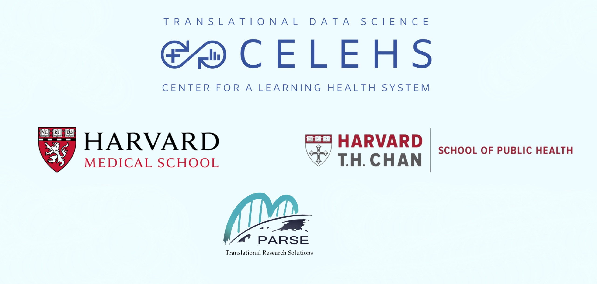

 

Welcome to Data Science in Action 2023!  

All program materials will be added to this website.

Get to know your instructors [here](https://celehs.hms.harvard.edu/camp_instructors.html). 

Get to know your TAs and Program Staff [here](https://celehs.hms.harvard.edu/camp_team.html).

[MA Camp Schedule](https://celehs.hms.harvard.edu/summer_camp/MASummerCampSchedule2023.pdf)

[CA Camp Schedule](https://celehs.hms.harvard.edu/summer_camp/CASummerCampSchedule2023.pdf)

   
******
Program Directors

 

   {width=100%}
   
<strong>Tianxi Cai</strong>

   
Professor of Biomedical Informatics, Harvard Medical School

   

   
 

  

   {width=100%}
   
<strong>Jessica Gronsbell</strong>

   
Assistant Professor, Department of Statistical Sciences, University of Toronto

  

  
  

   {width=1000%}
   
<strong>Junwei Lu</strong>

   
Assistant Professor of Biostatistics,  Harvard T.H. Chan School of Public Health 

  

 
  
 
   
******

 We are very grateful for support from our sponsors.
 
{width=100%}
